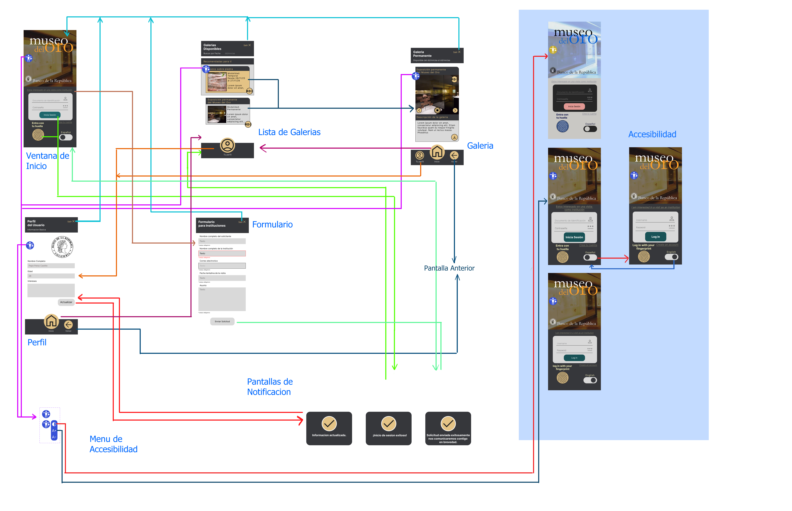

# Diseño

Esta carpeta contiene el archivo .fig que se puede encontrar en la carpeta de <strong>/Recursos/Museo_APP_UMB.fig</strong>, de igual manera se puede encontrar un archivo <strong>ArchivosPDF.zip</strong> con todas las pantallas.

  
A continuacion una recreacion de las interacciones entre las pantallas hechas de forma manual y una version tomada como captura de pantalla desde la interfaz de figma.

## Especificaciones del diseño_Manual

## Especificaciones del diseño_Figma

