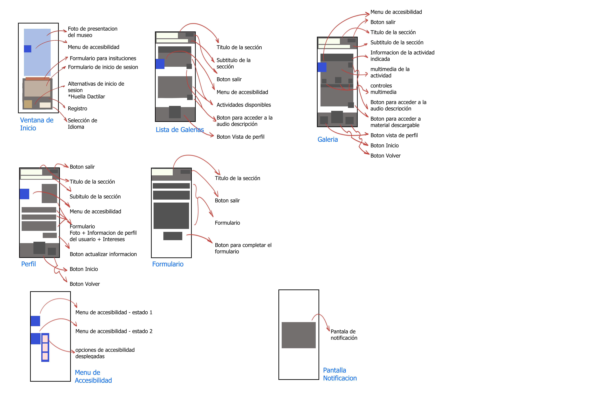
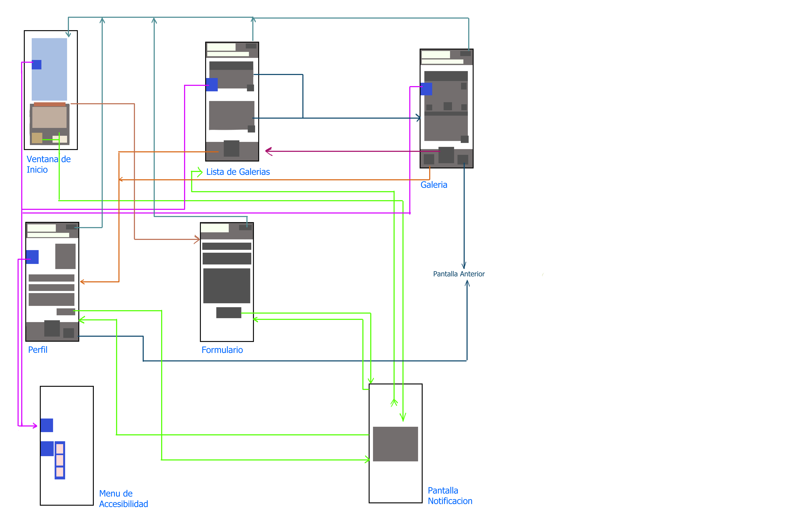

# Wifeframes

A continuación, los bocetos tipo wireframe de la App.

- ## Boceto 1
> Este Boceto detalla los elementos que componen la App.

- ## Boceto 2
> Este Boceto detalla las relaciones entre las secciones que componen la App.

